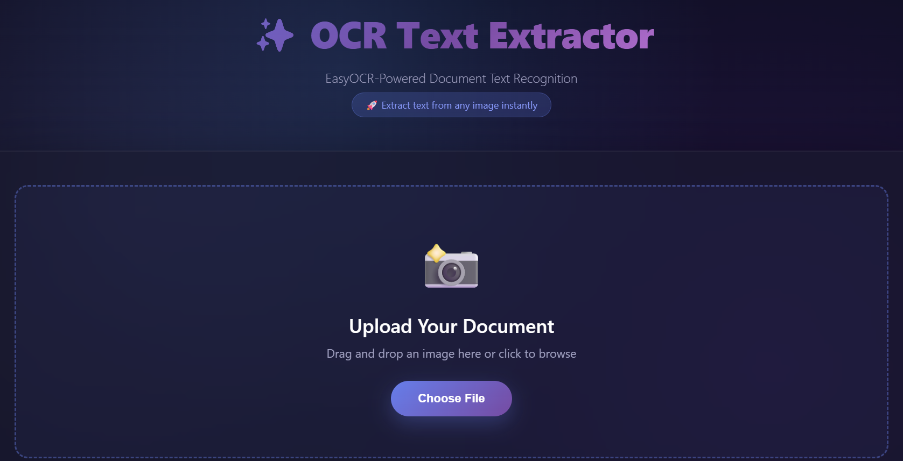
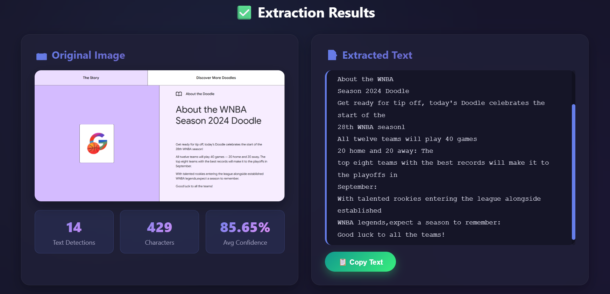

# 🧠 OCRify – AI-Powered Text Extraction Web App

**OCRify** is a Flask-based web app that extracts text from images using two selectable OCR options —  
**Tesseract OCR** (classical rule-based) and **EasyOCR** (deep-learning based with CUDA acceleration).  
Both deliver fast, accurate, and simple text recognition directly from your browser.

---

## 🖼️ Screenshots




---

## ⚡ Why EasyOCR is Better

**EasyOCR** uses deep learning (PyTorch) and GPU acceleration to achieve higher accuracy,  
supports 80+ languages, and performs better even on noisy, blurred, or handwritten images.

---

## 🌐 Features

- 🧠 Choose between **Tesseract OCR** or **EasyOCR**
- ⚡ **GPU acceleration** (CUDA + PyTorch)
- 🧩 **OpenCV preprocessing** with CLAHE, denoising, and thresholding (Tesseract mode)
- 🌍 **Multi-language support** via EasyOCR
- 🖼️ Simple and elegant **Flask web UI**
- 💬 Displays text, detections, and confidence levels
- ✨ Dark-themed responsive design with drag-and-drop upload

---

## 🛠️ Tech Stack

| Component | Technology |
|------------|-------------|
| **Backend** | Flask (Python) |
| **OCR Engines** | Tesseract, EasyOCR |
| **Image Processing** | OpenCV, PIL |
| **Deep Learning** | PyTorch |
| **GPU Acceleration** | CUDA |

---

## 🚀 Getting Started

### 1️⃣ Clone the Repository
```bash
git clone https://github.com/koligaurav462/ocrify.git
cd ocrify
```

### 2️⃣ Create a Virtual Environment
```bash
python -m venv venv
source venv/bin/activate   # On Linux/macOS
venv\Scripts\activate      # On Windows
```

### 3️⃣ Install Dependencies
```bash
pip install -r requirements.txt
```

### 4️⃣ Install System Dependencies

#### 🔹 Tesseract OCR

- **Windows**: [Download here](https://github.com/UB-Mannheim/tesseract/wiki)
- **Linux/macOS**:
```bash
  sudo apt install tesseract-ocr
```

#### 🔹 CUDA (Optional, for EasyOCR)

Enable GPU acceleration if you have CUDA installed:
```bash
python -c "import torch; print(torch.cuda.is_available())"
```

If it prints `True`, your GPU is ready.  
If not, install a CUDA-compatible PyTorch build from [PyTorch.org](https://pytorch.org/).

---

## 🖥️ Usage

### ▶️ Run with Tesseract OCR
```bash
python Tesseract.py
```

### ▶️ Run with EasyOCR
```bash
python EasyOCR.py
```

Then open your browser at 👉 **http://localhost:5000**

---

## 🔍 Workflow

1. Upload an image (receipt, document, or screenshot).
2. The image is preprocessed (if using Tesseract).
3. OCR extracts text, confidence, and detection count.
4. Extracted text is displayed instantly with copy and zoom options.

---

## 🏗️ Future Enhancements

- Unified dashboard to switch OCR options seamlessly
- Auto language detection
- PDF and multi-page OCR support
- REST API integration for external requests

---

## 👨‍💻 Author

**Gaurav Koli**  

---

## 📄 License

This project is open source and available under the [Apache License](LICENSE).
